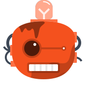
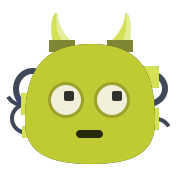
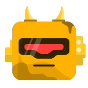
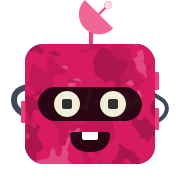
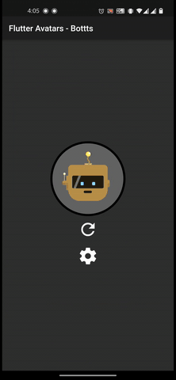
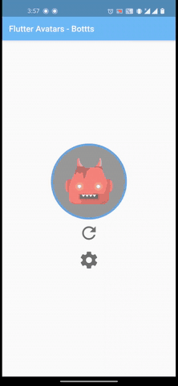

# Flutter Avatars - Bottts


A high perforamnce [Flutter](https://flutter.dev/) Widget to render [Bottts](https://bottts.com/) svg avatars on android/ios devices.

It's faster than other classical approaches because it's not using any API, rather it's rendering SVG strings on the fly !

## Bottts :
Characters Originally Designed by [Pablo Stanley](https://twitter.com/pablostanley), the Sketch library can be found on
[bottts.com](https://bottts.com/).

<p>
    
    
    
    
    
    
    
    
    
    
</p>

<p>
    
        
</p>
(App's theme changes based on your device's theme)

<br/>
<br/>

## Getting Started

1. Create Bottt object:
```Dart
// Create Bottt with default constructor
var _bottt = Bottt(
    color: Colors.red,
    eye: EyeType.Glow,
    face: FaceType.Square03,
    mouth: MouthType.Bite,
    side: SideType.Round,
    texture: TextureType.Dirty01,
    top: TopType.Horns,
);

// Randomize all properties
var _bottt = Bottt.random();

// Or keep some properties specific & remaining as random
var _bottt = Bottt.random(
  top: TopType.Horns,
  mouth: MouthType.Bite,
);
```

2. Create AvataaarImage widget and pass it the avatar:

```Dart
Padding(
    padding: EdgeInsets.all(20),
    child: BotttAvatar(_bottt),
)

// Alternatively you can also combine the widget with a CircleAvatar
CircleAvatar(
    radius: 90,
    child: CircleAvatar(
    radius: 85,
    backgroundColor: Color.fromARGB(255, 100, 100, 100),
    child: Padding(
        padding: EdgeInsets.all(20),
        child: BotttAvatar(_bottt),
    ),
    ),
)
```

### Persisting avatars

Use `Avataaar.toJson()` and `Avataaar.fromJson(String)` methods to serialize/deserialize avatars.
