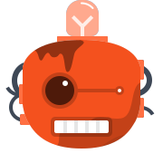
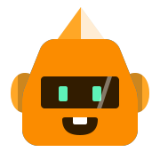
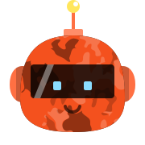
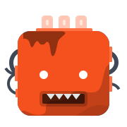
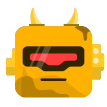
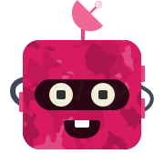

# Flutter Avatars

A high perforamnce [Flutter](https://flutter.dev/) Widget to render [Bottts](https://bottts.com/) svg avatars on android/ios devices.

Characters Originally Designed by [Pablo Stanley](https://twitter.com/pablostanley), the Sketch library can be found on
[bottts.com](https://bottts.com/).

    
    
    
    
    
    
    
    
    
    

Further work is in progress - will keep updating the document
