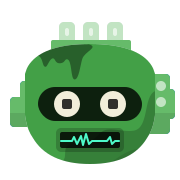

# Flutter Avatars

A high perforamnce [Flutter](https://flutter.dev/) Widget to render [Bottts](https://bottts.com/) svg avatars on android/ios devices.

Characters Originally Designed by [Pablo Stanley](https://twitter.com/pablostanley), the Sketch library can be found on
[bottts.com](https://bottts.com/).

    
    
    
    
    
    
    
    
    
    

    
        

(App's theme changes based on your device's theme)
